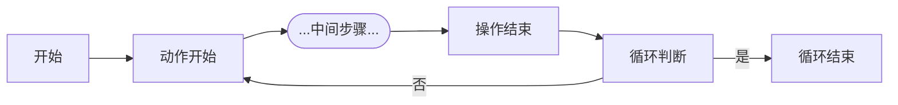

# 描述

- 克隆你自己的仓库到本地，并拉取子模块
  
        git clone --recursive https://github.com/0mika/MaaTest.git
    如已克隆但发现资源缺失，可运行：

        git submodule update --init --recursive

- python环境为开发环境，运行 `uv sync` 自动搭建环境

- 下载maaframework解压至deps文件夹中

- assets\MaaCommonAssets文件夹中放置通用模型，使用模型时导入到model\ocr中

---

## 常用链接

[Maaframe官网](https://maafw.xyz/)

[Maaframe知识库](https://deepwiki.com/MaaXYZ/MaaFramework)

[Win32 控制器虚拟密钥码](https://learn.microsoft.com/en-us/windows/win32/inputdev/virtual-key-codes)

---

## 循环流程示意图

信号位置：

- 开始
  - 状态初始化
  - 计数器归零
  - logger("开始")
- 动作开始
  - 计算器+1
  - logger("循环次数")
- 判断循环次数
  - context.override_next()覆盖节点
- 循环结束
  - 退出动作（DONothing）
  - logger("循环结束")
